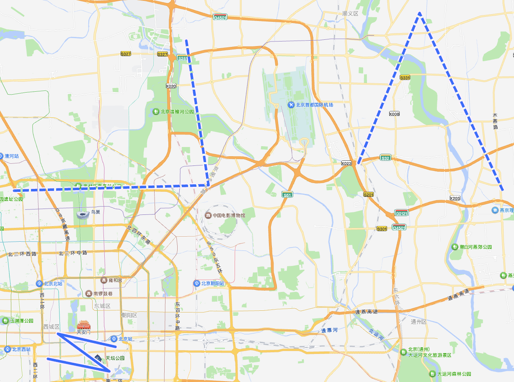
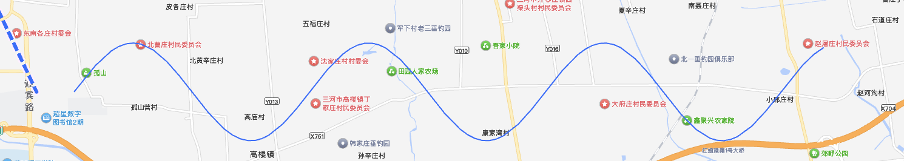
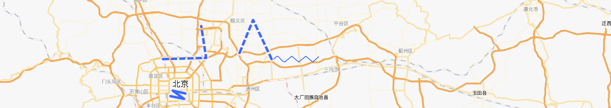
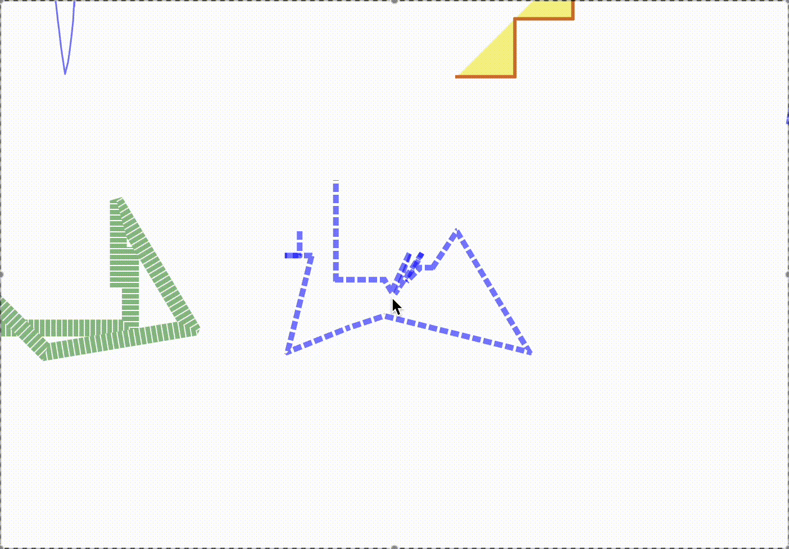
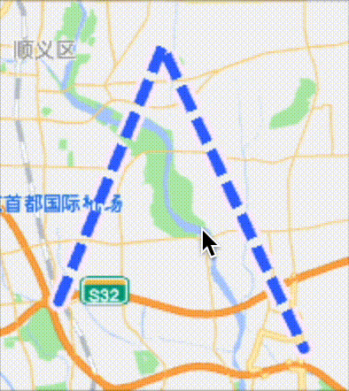

目标: 在地图上

- 画圆拐角的实线
- 画虚线，其中每一节是圆角矩形

## 使用地图SDK自带的API

以高德地图为例。
[官方文档](https://lbs.amap.com/api/javascript-api-v2/documentation#polyline)
[官方示例（有可以实时预览的代码编辑器）](https://lbs.amap.com/demo/javascript-api-v2/example/overlayers/polyline-draw)

由于官方文档已经足够详细了，这里不再重复。

它经过了实战考验，并且使用（相对）方便，但是存在一些问题导致选不了这个。

### 已知的问题

#### 对虚线的支持有限



如图，能画圆角；但是翻过文档之后发现，画不了我需要的虚线。整条虚线只能是同一个颜色，并且虚线中每一小节的两端是只能是平的。另外小节两端的锯齿也比较明显。

#### 折线会被过度简化

SDK会自动减少折线的线段数，或许是为了优化性能，但是简化的程度无法调整。

在高德地图的示例自带的代码编辑器，如果添加以下代码画一条曲线：

```js
// 使用const会在重新运行代码的时候报错，只好用var
var myPath = [...Array(1000)].map((_, index) => {
  const offset = 0.0001 * index;
  return [
    116.81213378906249 + offset + 0.01,
    40.01499435375046 + Math.sin(offset),
  ];
});
var myPolyline = new AMap.Polyline({
  path: myPath,
  strokeColor: "#3366FF",
  strokeOpacity: 1,
  strokeWeight: 2,
  zIndex: 500,
});
map.add(myPolyline);
```

效果会是这样：





## 使用开源方案: regl-line2d

[代码仓库](https://github.com/gl-vis/regl-line2d) [demo](https://gl-vis.github.io/regl-line2d/)

demo看起来不错，性能也很稳定，但依然存在一些问题。

### 存在的问题

#### 虚线的拐角





和高德地图对比，可以看到regl-line2d的拐角两边并没有很好的衔接起来。

#### 坐标系与坐标的单位不明确

regl-line2d的readme提供的信息有限，甚至没有注明坐标点的坐标系和单位。demo没有源码，取而代之的是直接在仓库里放一个构建好的html文件，难以阅读。尝试阅读了demo代码才发现，坐标系以canvas中心为圆点，x轴正方向在右边，y轴正方向在上边，其中y轴与canvas的坐标系是相反的。

#### 对虚线的支持有限

regl-line2d同样不能给虚线的小节设置圆角，也不能给折线贴上自定义的纹理。除非把它fork出来改代码。

<!-- [墨卡托投影（维基百科）](https://en.wikipedia.org/wiki/Mercator_projection)


这里引用一下[高德地图文档里的名词解释](https://lbs.amap.com/api/javascript-api-v2/guide/abc/components)

> 地图级别 ZoomLevel
>
> 级别与地图的比例尺成正比，每增大一级，地图的比例尺也增大一倍，地图显示的越详细。Web地图的最小级别通常为3级，最大级别各家略有不同，高德地图 JS API 目前最大级别为 20 级。
>
> 经纬度 LngLat
>
> 坐标通常指经纬度坐标，高德地图的坐标范围大致为：东西经 180 度（`[-180, 180]`，西半球为负，东半球为正），南北纬 85 度（`[-85, 85]`，北半球为正，南半球为负）。
>
> 地图平面像素坐标 Plane Coordinates
> 地图平面像素坐标指投影为平面之后的地图上的平面像素坐标，高德地图使用的Web墨卡托投影，在 3 级时，平面坐标范围为横纵`[0, 256*2^3]`像素，每级别扩大一倍，即第 n 级的平面坐标范围为 `[0, -256*2^n]`像素。

为了在单独的canvas上绘图，需要把经纬度转换成像素坐标。
高德地图SDK提供了AMap.Map.lngLatToContainer方法，可以直接把经纬度转换成相对与地图容器左上角的像素坐标，但是
 -->

## 自己画：Canvas

使用canvas画折线。

由于每一帧都需要遍历所有轨迹点，性能会受到cpu限制，画不了太多轨迹点。不过对于只有一两条折线的情况，数千个轨迹点已经够用了。TODO: 数千个？


## 自己画: pixijs/three.js等

pixi.js 自带的pixi

## 自己画：WebGL(feat. regl)

## 在更进一步之前

墨卡托投影
缩放级别的定义
经纬度坐标、容器坐标、像素坐标
测试数据：https://mourner.github.io/simplify-js/website/test-data.js

### 数学库

math.gl x
@pixi/math x
three x
turf x
gl-matrix o

### 工具

regl(amap也在用)
simply.js
turfjs?
polyline-normals
lineclip

## 手搓

### Canvas

roundRect
避免alloc、避免external api call

### WebGL

https://webgl2fundamentals.org/

#### Instanced drawing

#### 生成mesh

gl-matrix
simply.js
canvas-roundrect-polyfill
regl
regl-line2d

没用到的
lineclip
turfjs
@mapbox
mathjs
math.gl
@pixi/math
threejs math

https://wwwtyro.net/2019/11/18/instanced-lines.html

https://wwwtyro.net/2021/10/01/instanced-lines-part-2.html

https://mattdesl.svbtle.com/drawing-lines-is-hard
polyline-normals
