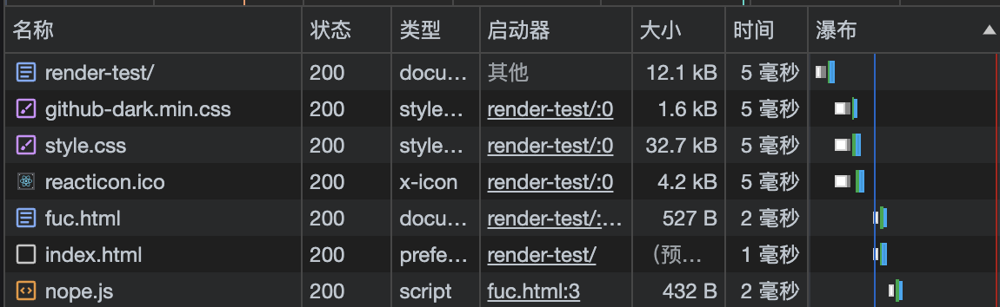

距离上次写博客的代码（libdgc-ssg）已经过去了10个月。之前写的东西不堪回首，于是重新写了一个更轻量的东西。

## 主要特点

- 使用 Markdown 编写博客正文，支持 html、GFM（GitHub Flavored Markdown）和 frontmatter
- 每篇文章拥有私有的资源（目录结构如下），可以使用相对路径引用；可以在文章中插入 iframe 来运行任意代码
  ```
  - posts
    - post-name
      - index.md
        - assets
          - a.png
          - b.html
      - c.png
    - other-post
    ...
  ```
- 自动从 Markdown 生成目录
- 轻量。下图展示了 [Markdown 渲染测试](/posts/render-test/)加载的文件，仅数十kb。
  

## 基本架构

[Bun](https://bun.sh/) + React + Typescript + [unified](https://unifiedjs.com/) + [tailwind](https://tailwindcss.com/)

用 unified 处理 markdown、生成 html，用 React 写页面，用 tailwind 写样式，最后用 bun 跑脚本生成静态网页。

## blah blah

没有文章的话博客就没有意义了。并且最近积攒了一点想法，是时候开始写一点东西了。
