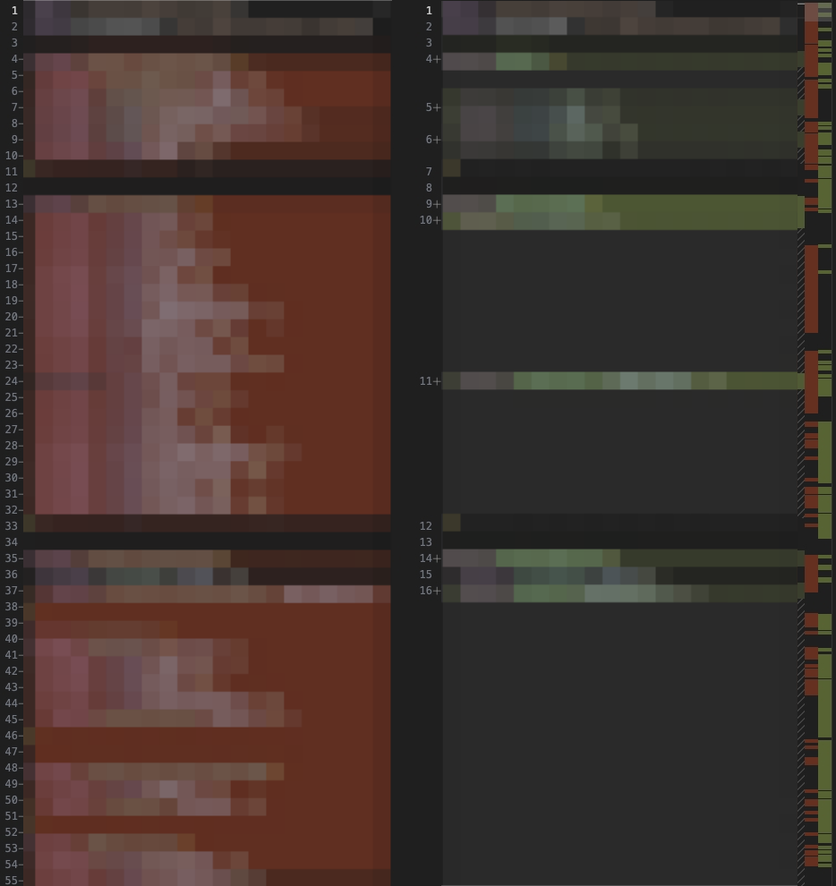

<iframe style="width:100%;height:30rem;" src="./assets/sorter/sorter.html"></iframe>

1. 后端定义好接口
2. 从后端代码生成 protobuf schema（proto 文件）
3. 前端用 proto 文件生成请求接口的代码

这是我们团队里常见的工作流。

然而有个痛点：后端生成的 proto 文件内，代码的顺序是随机的。哪怕后端只改了一个字段，把文件放进仓库后会变成这样：



因此有了这个工具。

## 原理

protobuf schema 使用 `message` 等代码块定义数据结构。下面这样的定义：

```protobuf
message Aaa {
    optional string bbb = 1;
    optional int32 ccc = 2;
}
```

用 typescript 表示的话就是：

```typescript
type Aaa = {
  bbb?: string;
  ccc?: number;
};
```

代码块内的顺序是固定的，所以只需要以代码块为单位排序。

<small>除了 `message` 还有[几种代码块](https://protobuf.dev/reference/protobuf/proto2-spec/#top_level_definitions)，这里只提最常用的 `message`。  
上面的链接指向 proto2 语法的定义，不过这个工具理论上是兼容 proto3 语法的。
</small>

标识符（上面的 `Aaa`）是唯一的，所以我们可以让标识符按字母顺序排序，从而保证顺序是固定的。

## 实现

概括一下：

1. 用 protobufjs 的 tokenizer 把代码转换成 token
2. 匹配 token 来找到代码块
3. 把代码块的标识符和位置记下来
4. 用标识符排序，把排序前的代码块换成排序后的

<small>更稳健的做法是把代码解析成 AST（抽象语法树），修改 AST，然后生成代码。
没有这样做是因为我希望代码格式（缩进等）保持不变</small>

具体实现比较长，请移步[这里](https://github.com/nyonsama/libdgc-static/blob/main/posts/protobuf-schema-sorter/assets/sorter/sort.js)或者 F12，找 `sort.js`。
