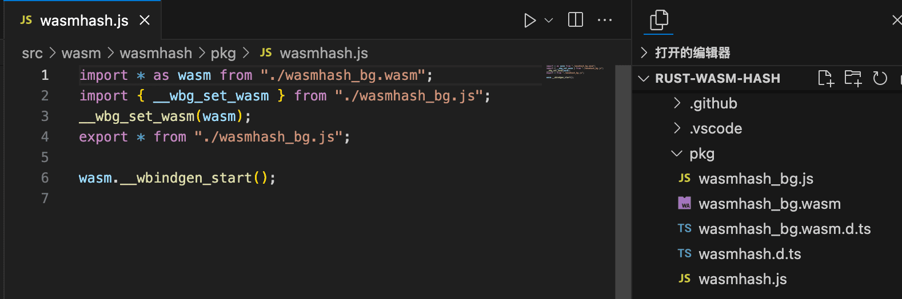
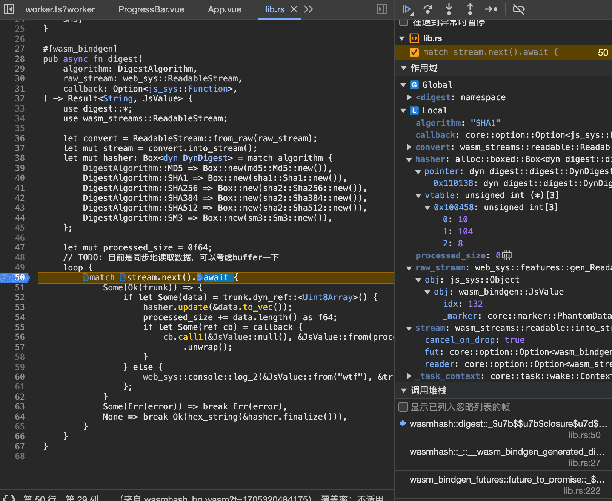
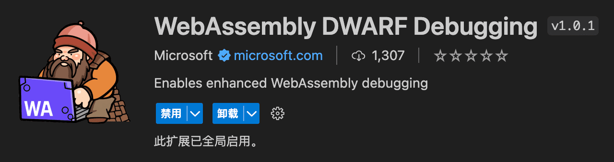
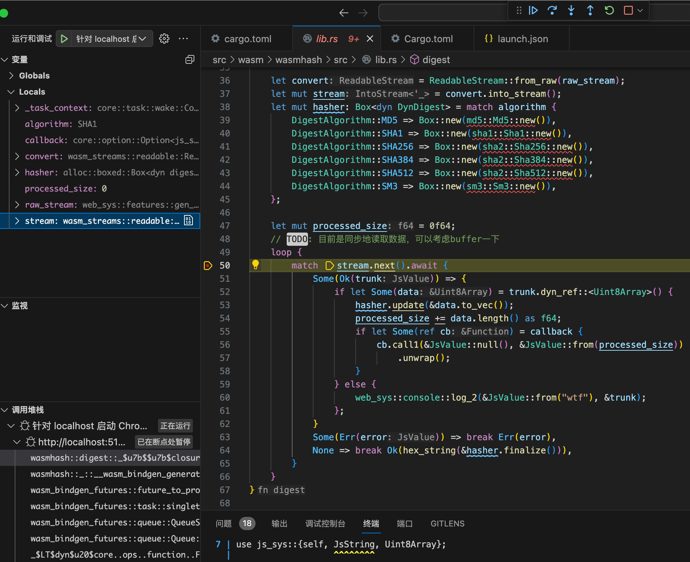

一个玩具哈希计算工具。

## Showcase

（可以同时选择多个文件）

<a target="_blank" href="./dist/index.html">在新窗口打开</a>

⚠️ 由于代码未经优化、操作系统的调度、CPU 大小核等因素，这个不能用来精确比较 WASM 与纯 JS 的性能差异。

<iframe style="width:100%;height:800px" src="./dist/index.html"></iframe>

[仓库地址](https://github.com/nyonsama/libdgc-static/tree/main/packages/rust-wasm-hash)

## 介绍

写这个东西的初衷是熟悉在浏览器中使用 Rust + WASM 的一套流程。

主要有三个功能点要实现：计算哈希、并行计算、展示进度。

## 搭建项目

前端是典型的 Vue + TS 的 Vite 项目。这里主要提一下 Rust + WASM 项目的注意事项。

官方推荐阅读 [Rust 🦀 and WebAssembly 🕸](https://rustwasm.github.io/docs/book/introduction.html) 来入门。

使用 [wasm-pack](https://rustwasm.github.io/docs/wasm-pack) 管理项目（包括创建、构建、测试等）

在代码中使用 [wasm-bindgen](https://crates.io/crates/wasm-bindgen) 提供的宏来实现 WASM 与 JS 的互操作（[The wasm-bindgen Guide](https://rustwasm.github.io/docs/wasm-bindgen/) 有~~很多例子可以抄~~详细说明）

### 在 Vite 项目中导入 WASM

`wasm-pack` 能生成 JS 胶水代码和 TS 类型声明，默认生成的是这样的代码：



可以使用 `--target` 选项设置生成的胶水代码（[文档](https://rustwasm.github.io/docs/wasm-pack/commands/build.html#target)），不过这里保持默认就可以。

在 JS 这边，直接导入 `wasmhash.js` 就行，但是需要配置一下 Vite：

```typescript
import { defineConfig } from "vite";
import vue from "@vitejs/plugin-vue";
import wasm from "vite-plugin-wasm";

// https://vitejs.dev/config/
export default defineConfig({
  plugins: [vue()],
  worker: {
    format: "es", // 在 Worker 中使用 ES Module
    plugins: () => [wasm()], // 使用 ES Module 导入 WASM
  },
  // 后面和 WASM 无关
  base: "./",
  build: {
    sourcemap: true,
    target: "es2022",
  },
});
```

这个配置使用 ES Module 导入 Worker 的代码和 WASM 模块，需要比较新的浏览器才能跑。要兼容老浏览器就得改改了。

### Debug WASM

⚠️ 此处有个小坑：目前（2024 年 1 月 15 日）wasm-pack 还不支持输出带有调试信息的 wasm 文件（[issue #1351](https://github.com/rustwasm/wasm-pack/issues/1351)），解决办法见 [VSCode 文档](https://code.visualstudio.com/docs/nodejs/nodejs-debugging#_debugging-webassembly)。

只要编译器生成了debug信息，理论上可以使用 Chrome 或 VSCode 来 debug。但是两者目前都不成熟，并且需要安装额外的插件。

#### 使用 Chrome debug WASM

安装了 [C/C++ DevTools Support (DWARF)](https://goo.gle/wasm-debugging-extension) Chrome 插件即可。[调试 C/C++ WebAssembly](https://developer.chrome.com/docs/devtools/wasm?hl=zh-cn)（Chrome 文档）有详细的说明。虽然没有提到 Rust，不过撞上插件后，也能给 Rust 下断点，如图。



一个显而易见的缺点是没有语法高亮。此外提供的信息也比较基本。

#### 使用 VS Code debug WASM

[VSCode 文档](https://code.visualstudio.com/docs/nodejs/nodejs-debugging#_debugging-webassembly)给出了详细的说明。简要概括就是安装[插件](https://marketplace.visualstudio.com/items?itemName=ms-vscode.wasm-dwarf-debugging)，然后让 VSCode 启动 Chrome。



~~截至 2024 年 1 月 15 日，这个插件目前只有 1307 次下载。~~



除了支持语法高亮以外，和使用 Chrome 的效果差不多。

## 计算哈希

出于比较和闲得慌，这里使用了三种后端：原生、wasm、js。

### 使用浏览器原生 API 计算哈希

现代浏览器提供了 `SubtleCrypto.digest()`来计算哈希。（[MDN](https://developer.mozilla.org/zh-CN/docs/Web/API/SubtleCrypto/digest)）

使用起来很简单：

```typescript
// let data: ArrayBuffer | Uint8Array | ...
const hash: ArrayBuffer = await crypto.subtle.digest("SHA-256", data);
```

并且性能非常好，但是有一些限制

- 只能在[安全上下文](https://developer.mozilla.org/zh-CN/docs/Web/Security/Secure_Contexts)（https 或 localhost）使用
- 只支持 `sha1 sha256 sha384 sha512` 这 4 种算法
- 只能一次计算整个 buffer
  - 要计算文件哈希的话需要将文件全部读进内存
  - 不能展示计算进度
- 返回的哈希值是 ArrayBuffer，需要自己转换成 hex

### 使用 WASM 计算哈希

[RustCrypto/hashes](https://github.com/RustCrypto/hashes) 记录了 Rust 生态中各种哈希函数的包，并且它们都实现了同一个接口，使用起来比较方便。以 MD5 为例：

```rust
use md5::{Md5, Digest};

let mut hasher = Md5::new();
hasher.update(b"hello world");
let result = hasher.finalize();
```

此外还用到了：

- [wasm-streams](https://crates.io/crates/wasm-streams)：在 Rust 中操作 [Web Stream](https://developer.mozilla.org/zh-CN/docs/Web/API/Streams_API)

- [faster-hex](https://crates.io/crates/faster-hex)：将计算结果编码为 hex

⚠️ 有个小坑：上面计算哈希的代码在 IDE 里会报错，但是编译时没有问题（[rust-analyzer issue #15813]()）。目前（2023.01.15）没有很好的解决办法。[issue #15242](https://github.com/rust-lang/rust-analyzer/issues/15242#issuecomment-1628922211) 给出了绕过的方法：

```rust
// let mut hasher = Md5::new();
let mut hasher = <Md5 as Digest>::new();
```

### 使用纯 JS 计算哈希

目前使用最广泛的包大概是 [crypto-js](https://www.npmjs.com/package/crypto-js)。支持很多种哈希，并且自带 hex 编码，但它很老旧，不支持处理 `ArrayBuffer` 和 `TypedArray` 之类的数据。

解决方法是换成 [crypto-es](https://www.npmjs.com/package/crypto-es)。它是使用现代JS重写过的 crypto-js，在保持 API 不变的同时解决了上述问题。

## 并行

### Web Worker 和 Worker 池

为了同时计算多个文件，需要同时使用多个 Worker，自然要用到 Worker 池。推荐使用 [`workerpool`](https://github.com/josdejong/workerpool)，它能在浏览器使用，并且仍在活跃维护。

与通常的线程池不同，使用 Worker 池需要把要在 Worker 里跑的代码单独写在一个文件里。另外，在 Worker 与主线程之间通信一般使用 `postMessage`（[这个](https://developer.mozilla.org/zh-CN/docs/Web/API/Worker/postMessage)和[这个](https://developer.mozilla.org/en-US/docs/Web/API/DedicatedWorkerGlobalScope/postMessage)）异步通信，不能使用全局变量和锁（[`SharedArrayBuffer`](https://developer.mozilla.org/zh-CN/docs/Web/JavaScript/Reference/Global_Objects/SharedArrayBuffer) 可以实现类似全局变量和锁的通信方式，但是用起来很麻烦）。

我在写的时候没找到这个库，当时实现了一个简单的 Worker 池。~~代码很乱~~

<!-- ，它有以下几个功能： -->

<!-- - 创建一定数量的 Worker
- 接受任务并将任务交给 Worker
- 在 Worker 不够用的时候推迟执行新任务
- 在 Worker 传回信息的时候运行相应的回调
- 任务完成后做相应的清理
- 终止所有任务

有一个限制：这里的“任务”是在 Worker 的 JS 代码里事先定义好的。主线程告诉 Worker 要运行哪个任务以及参数，然后 Worker 去执行任务。不能直接给 Worker 池一个函数让它跑。

在 Python 中，你可以把一个函数交给线程池去执行，但是在 Web 实现这个逻辑会很麻烦。

同一进程下的线程共享同一个内存空间，不同线程可以共享全局变量和堆。但是 Web Worker 与线程不同，Worker 之间是隔离的，虽然有 `SharedArrayBuffer` 能用来在Worker之间共享内存

展示计算进度、同时计算多个文件 -->

### 在 WASM 中使用并行

Native 和纯 JS 后端比较好处理，用 Web Worker 就可以了。WASM 有一些坑，需要斟酌一下。

虽然[主流浏览器已经支持](https://webassembly.org/features/)了 [WASM threads feature](https://github.com/WebAssembly/threads/blob/master/proposals/threads/Overview.md)，但是这个特性只包含共享内存和原子操作，不涉及创建线程和 join 线程。要在 WASM 里使用线程的话，只能借助 Web Worker。

目前 Rust 有 [`wasm-bindgen-rayon`](https://github.com/RReverser/wasm-bindgen-rayon) 这个库可以用，它借助 Web Worker 把并行工具库 [`Rayon`](https://github.com/rayon-rs/rayon) 移植到了 WASM 平台，可以使用并行迭代器之类的好东西。

但目前 `wasm-bindgen-rayon` 存在很多限制，它的 Readme 里写了，我这里就不一一列举了，总之用起来会很麻烦。

出于以上考虑，最后选择由 JS 管理 Web Worker，WASM 里面只写单线程的代码。

## 展示计算进度

Native 后端展示不了进度，只支持一口气计算完。

WASM 后端和 `crypto-es` 后端能给文件流计算哈希，从而可以在每计算一个 chunk 后统计已经计算了多少数据，并使用`postMessage`发送给主线程。

## 前端

最后稍微介绍一下前端。

Vite + Vue + TS + TailwindCSS

使用 TS 的经验还不够，代码写的很乱。

## 总结

体验了一下在浏览器中使用 Rust + WASM。结论是基础设施还不够完善，也意识到了浏览器的一些局限性。不过已经可以拿来做很多东西了。
